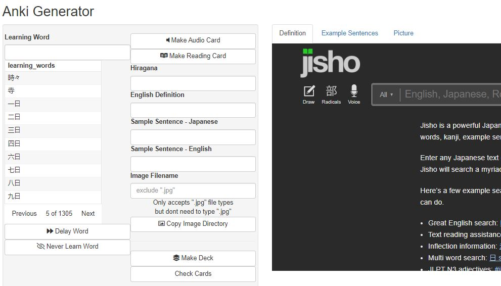
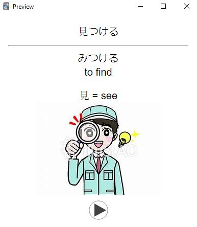

## Purpose

This is a Shiny app for making Anki flashcards for learning Japanese. It
aids in making these flashcards in two ways

1.  Identify highest priority cards to be learned

2.  Put all pieces of a card together to avoid copying & pasting between
    Anki and other web pages

### Identify Highest Priority Cards: To-Learn List

`df.to_learn` pulled from *inst/List - To Learn.RDS* contains a list of
some 10,000 Japanese words to learn. It was created through a process
detailed in *Initialization Workflow/Initialization Workflow.Rmd* which
combines a frequency list from the internet with another Anki deck and
gives a priority ranking to how high each word was up in each list

From that list the user's vocabulary deck is joined as well as their
Heisig deck. Words from the list To-Learn list are given low priority if
they contain kanji that the user has not seen in Heisig.

It also gives low priority to words already learned and to works marked
on a never learn list which can be appended from within the app

### All Pieces of Anki Card Together

By clicking on a word in the To-Learn list within the app the following
sites will be searched for that word and can be quickly compiled into an
Anki card

Included pieces:

-   Links to definition and furigana from
    [jisho.org](https://jisho.org/)
-   Links to example sentenes from
    [weblio.jp](https://ejje.weblio.jp/sentence/)
-   Links to pictures from
    [Bing](https://www.bing.com/images/feed?form=Z9LH)

## Created Cards

Can either be reading-front or audio-front cards

Reading-front cards will not use the example sentence

Audio-front cards will use the audio from the example sentence as the
back audio

You may want to change the template for the created cards within Anki to
your liking as the default template has no formatting

The result will look like this:

## How-To

In the *global.R* file, set the filepaths to the appropriate filepaths
for your deck and media collection

If using another deck, will probably need to modify the parsing piece in
*global.R* so that it can correctly parse learning words... otherwise
add a field for Learning Word and manually fill it in so it can be
easily parsed

Run the app, click on a word from the list, fill in the desired pieces,
click to create either learning or reading card, then click to create
deck

Once deck is created, it can be imported into Anki, then the
[AwesomeTTS](https://ankiweb.net/shared/info/1436550454) add-on can be
used to generate the audio as follows:

-   **Front Audio** to **Front** with ***Overwrite***
-   **Back Audio** to **Back** with ***No Overwrite***

Then you're all set!
